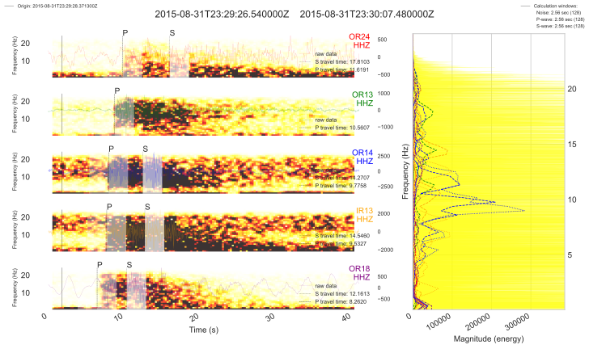

# Seismology toolkit to compliment the fresh seismologist education

* A collection of various modules for seismological research.
Mostly intended for personal use and education of students.
**Primarily based on [ObsPy](https://github.com/obspy/obspy) - A Python Framework for Seismology.**
Core idea here is to use vast and growing toolkit that is available now.
NOT to reinvent bike parts - just assemble a custom touring bicycle ^-^

* Works as a repository to test ideas before contributing it elsewhere.

## Environment used (~1.5 GB)

```sh
conda create -n seismology -c conda-forge python=3.11 obspy cartopy pygmt icecream pyyaml
conda activate seismology
pip install dearpygui
```

## Some examples


